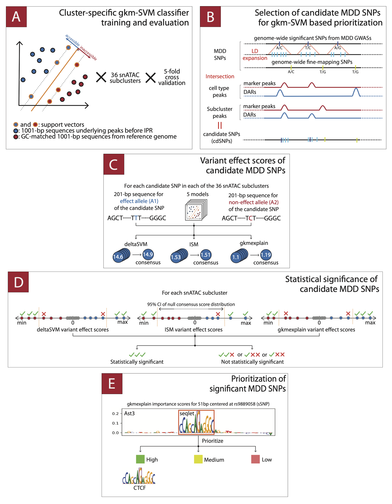

# 5 - Gapped k-mer SVM-based workflow and related downstream analyses

## Main

This directory contains the scripts developed for (1) our adaptation of snATAC-cluster-specific gapped k-mer SVM (gkm-SVM) workflow previously proposed by Corces et al. [1]; as well as (2) downstream analyses performed on gkm-SVM-based workflow results.

### Important Note

Before proceeding, please see Supplementary Figure 6 (provided below) which visually describes our adaptation of the workflow. For more details, please see supplementary methods of the manuscript.

<figure style="text-align:center;display: flex; flex-direction: column; align-items: center;">
  
  <figcaption style="text-align:justify; width: 90%;" > Supplementary Figure 6: A schematic describing gkm-SVM based variant-scoring workflow [1] employed for each snATAC cluster. (A) Cluster-specific gkm-SVM classifiers were trained to predict cCRE status of input 1001-bp genome sequences via 5-fold cross validation. (B) MDD SNPs located within 1001-bp marker cCREs and DARs are pooled to obtain candidate SNP set per cluster (cdSNPs). (C) gkm-SVM-based cdSNP variant effect scores were computed by running ISM, deltaSVM and gkmexplain on 201-bp allelic sequences of cdSNPs. (D) Statistical significance of cdSNPs were assessed with respect to score-specific null t-distributions fitted to null variant effect scores computed on shuffled (di-nucleotide preserved) 201-bp allelic sequences. For each score type and cluster, cdSNPs whose variant effect scores unanimously lie outside of 95%CI of respective null distributions were coined as statistically significant (sSNP). (E) sSNPs were further partitioned into three groups according to the prominence and magnitude of their allelic impact to their immediate (seqlet) as well as 51-bp neighborhood. Additionally, seqlets of sSNPs having high or medium importance were interrogated for potential TFBS matches in CIS-BP 2.0 (TOMTOM, q-value < 0.1). Please see supplementary methods for     implementation specific details regarding the workflow, and supplementary results for reliability analysis of workflow components.</figcaption>
</figure>

## Table of Contents

#### 5_0 [Data preparation](./scripts/5_0_data_preparation/README.md) 
#### 5_1 [gkm-SVM classifier training and evaluation](./scripts/5_1_gkmSVM_classifiers/README.md) (Panel A)
#### 5_2 [MDD SNPs and selection of candidate MDD SNPs (cdSNPs)](./scripts/5_2_candidate_MDD_snps/README.md) (Panel B)
#### 5_3 [ISM, deltaSVM and gkmexplain-based variant effect scores of cdSNPs](./scripts/5_3_variant_effect_scores/README.md) (Panel C)
#### 5_4 [Confidence sets of statistically significant cdSNPs (sSNPs)](./scripts/5_4_statistical_significance/README.md) (Panel D and Panel E)
#### 5_5 [Downstream analyses on MDD SNPs, cdSNPs and sSNPs](./scripts/5_5_downstream_analyses/README.md)

## References

[1]: Corces, M. Ryan, et al. "Single-cell epigenomic analyses implicate candidate causal variants at inherited risk loci for Alzheimer’s and Parkinson’s diseases." Nature genetics 52.11 (2020): 1158-1168.
